# Patch-base progressive 3D Point Set Upsampling
## cite ##
```
```

<center>

virtual scan | 16x upsampled | real scan | 16x upsampled
------------- | ------------- | ------------- | -------------
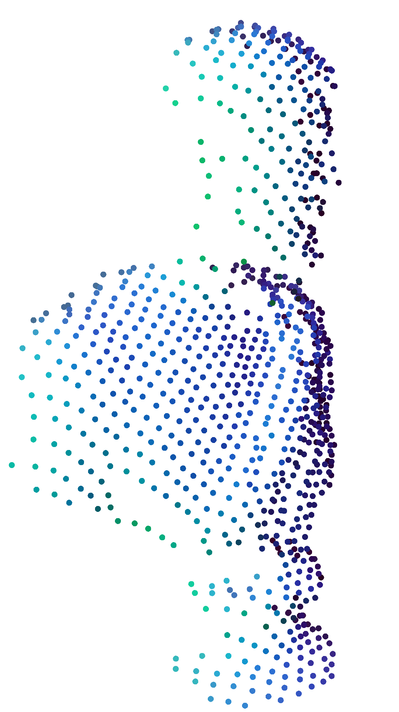|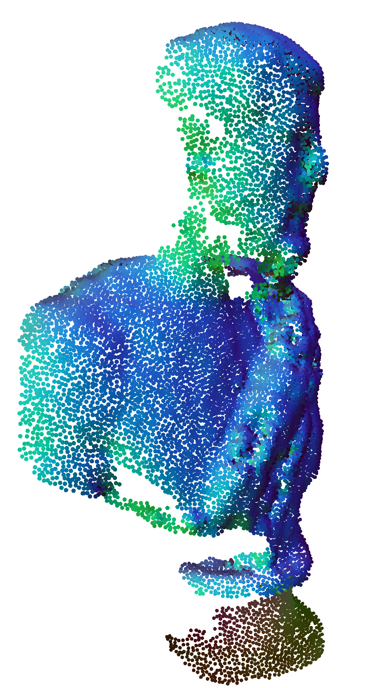 | 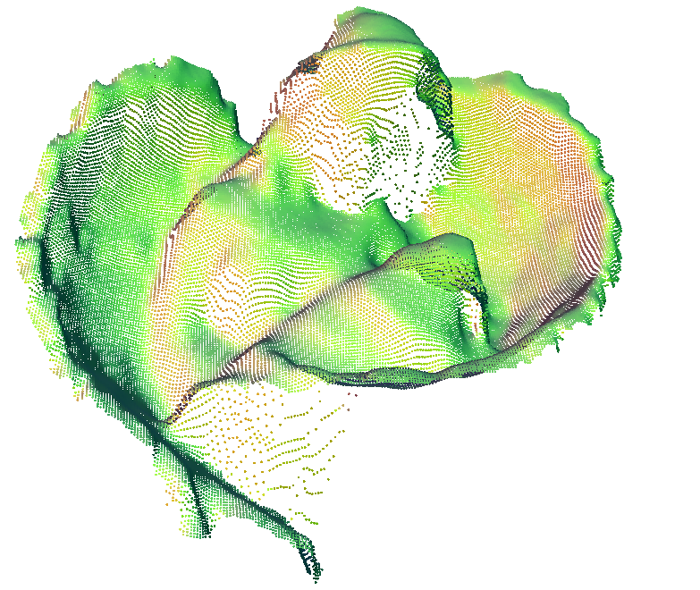|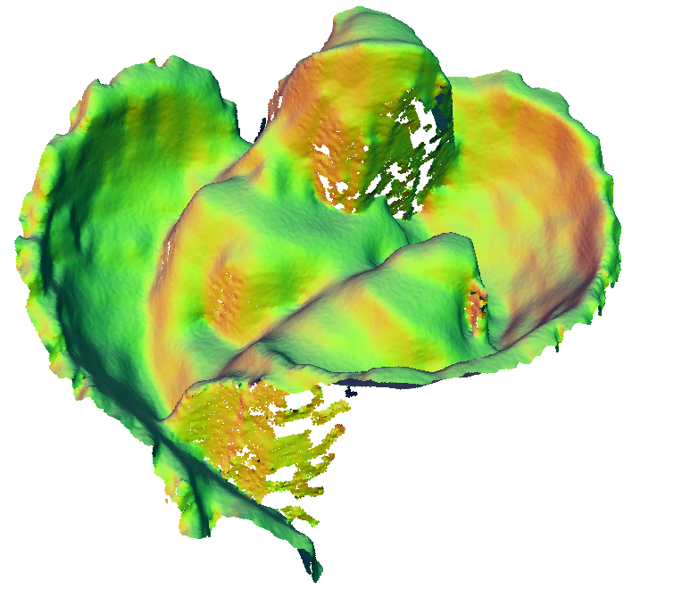

Input | output | ground truth | Input reconstruction | output reconstruction | ground truth reconstruction| 
------------- | ------------- | -------------  | -------------  | -------------  | ------------- 
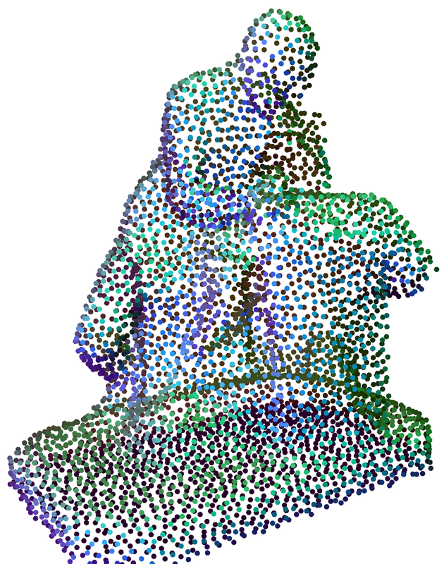 | 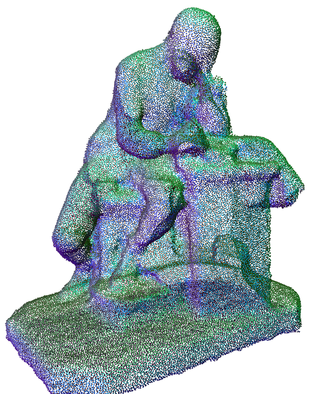 | 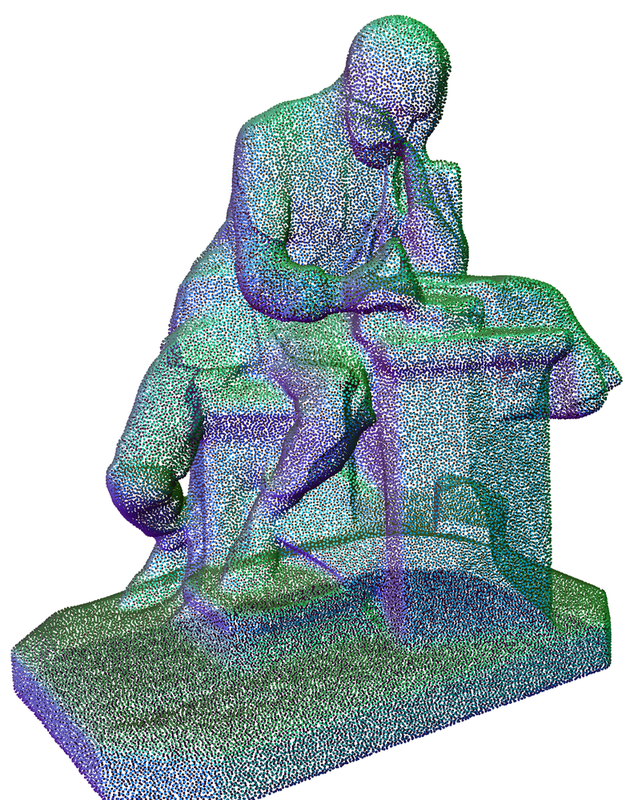 | 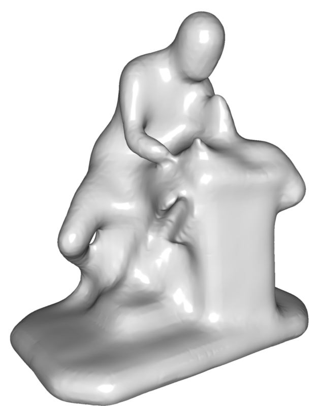 |  | 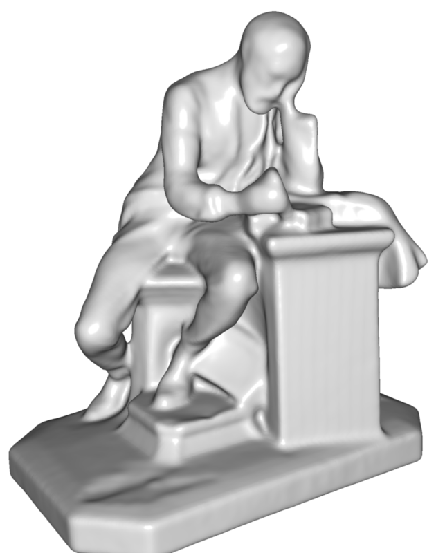 
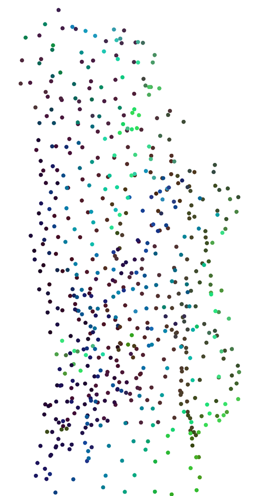 | 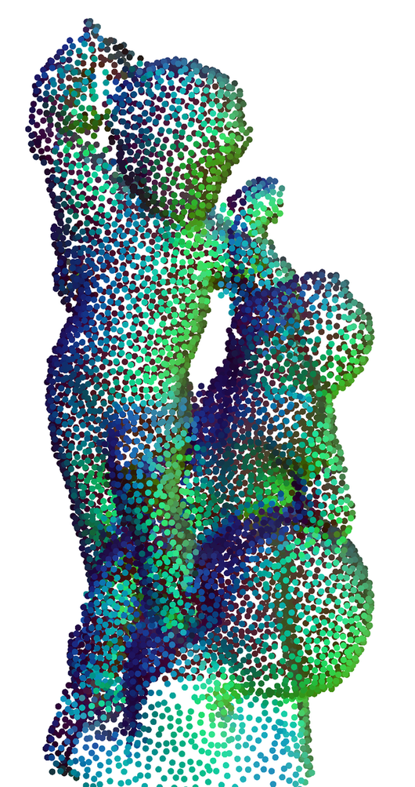 | 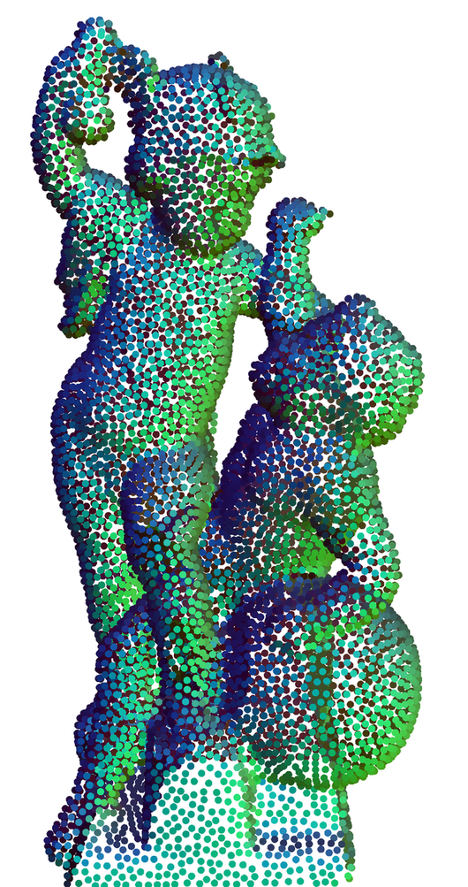 | 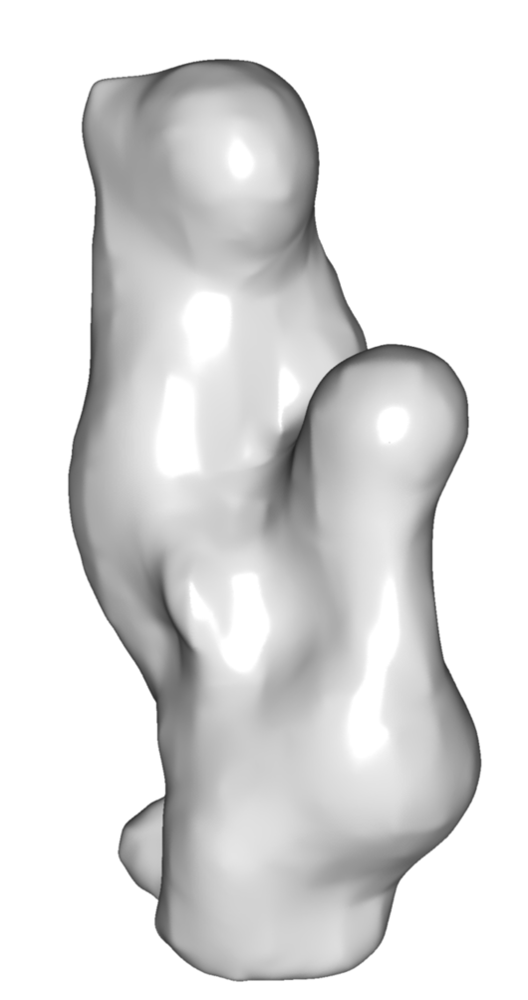 | 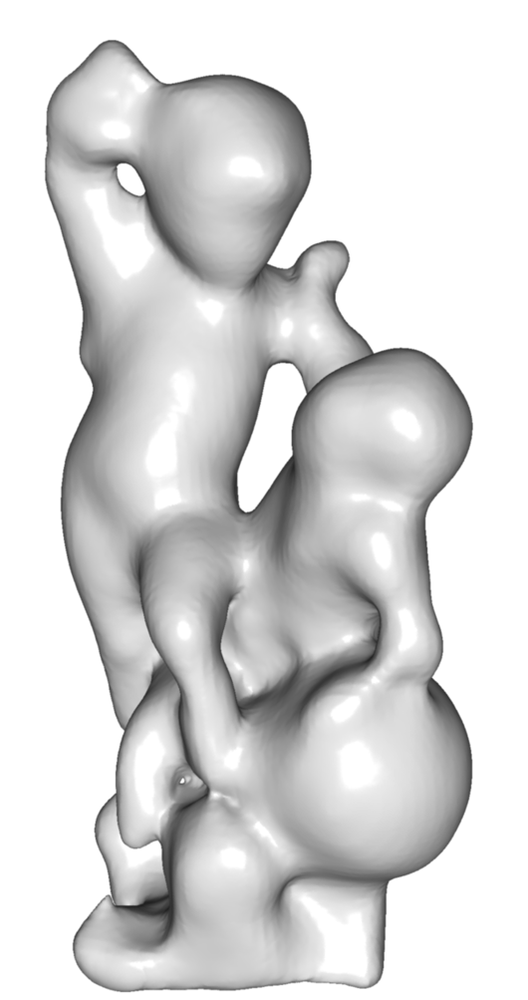 | 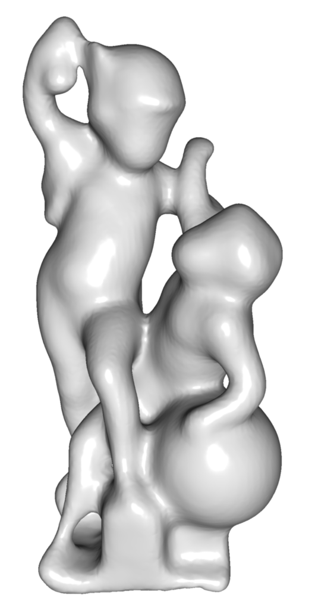

</center>

## Quick Demo ##

```bash
# clone
git clone https://github.com/yifita/P3U.git --recursive
cd mpu
# download pretrained models
curl -o model/pretrained.zip -O https://polybox.ethz.ch/index.php/s/TZjUeCWFPlmv0nj/download
unzip -d model/ model/pretrained.zip
# download test data
curl -o data/test_data/test_points.zip -O https://polybox.ethz.ch/index.php/s/wxKg4O05JnyePDK/download
unzip -d data/test_data/ data/test_data/test_points.zip

# conda environment
conda env create -f environment.yml

# automatically add cuda library path permanently to the current conda enviroment
mkdir -p $HOME/anaconda3/envs/PPPU/etc/conda/activate.d
cp activate_cuda_90.sh $HOME/anaconda3/envs/PPPU/etc/conda/activate.d
mkdir -p $HOME/anaconda3/envs/PPPU/etc/conda/deactivate.d
cp deactivate_cuda_90.sh $HOME/anaconda3/envs/PPPU/etc/conda/deactivate.d
conda activate PPPU

# install tensorflow
pip install --ignore-installed --upgrade https://storage.googleapis.com/tensorflow/linux/gpu/tensorflow_gpu-1.11.0-cp35-cp35m-linux_x86_64.whl

# compile
cd code/tf_ops
cd CD && make -j
cd ../grouping && ./tf_grouping_compile.sh
cd ../sampling && ./tf_grouping_compile.sh

# run code
cd code
python main_curriculum_interleave.py --phase test --id sketchfab_poisson --model dense_interlevelplus \
--num_point 312 --up_ratio 16 --step_ratio 2 --patch_num_ratio 3 \
--test_data "data/test_data/sketchfab_poisson/poisson_5000/*.xyz"
```

## data preparation ##
### Sketchfab dataset ###
Our 3D models are trained and tested using the [Sketchfab](https://sketchfab.com/) dataset created by ourselves. It consists of 90 training models and 13 testing models collected from [Sketchfab](https://sketchfab.com/). You can download the original meshes here: [training][train_mesh] and [testing][test_mesh].

### Input points ###
We trained our models with two kinds of input points: point sets generated using poisson disc sampling and virtual scanner. 
Download the [test][test_points] and [training data][train_record] used in our experiments. Unzip the test data to `data/test_data/` and unzip to training data to `record_data/`

Additionally, you can create your own data with a virtual scanner or poisson disc sampling. 
```
# compile
cd prepare_data
cmake .
make -j

# sample
cd Poisson_sample
./run_pd_sampling.sh DIR_TO_MESH DIR_TO_OUTPUT "**/*.EXTENSION" NUM_POINTS

# scan
cd polygonmesh_base
./run_scan.sh DIR_TO_MESH DIR_TO_OUTPUT 1 "**/*.ply"
```

### Pretrained model ###
We provide two models trained using each of the above mentioned data. Download them [here][pretrained], and unzip them under `model/`.

## tensorflow code compile ##
0. Install cuda 9.0, cudnn and nccl if you haven't done so yet.
1. Create conda environment `conda env create -f environment.yml`.
2. Install tensorflow, we use tensorflow 1.11 in this project, but tensorflow >= 1.5 should work.
3. Compile the custom tensorflow code in `code/tf_ops` by running `./tf_*_compile.sh`.

## Testing ##
### paper results ###
Test on sparse poisson input:
```
python main_curriculum_interleave.py --phase test --id sketchfab_poisson --model dense_interlevelplus --num_point 156 --up_ratio 16 --step_ratio 2 --patch_num_ratio 3 \
--test_data "data/test_data/sketchfab_poisson/poisson_625/*.xyz"
```
Test on dense poisson input:
```
python main_curriculum_interleave.py --phase test --id sketchfab_poisson --model dense_interlevelplus --num_point 312 --up_ratio 16 --step_ratio 2 --patch_num_ratio 3 \
--test_data "data/test_data/sketchfab_poisson/poisson_5000/*.xyz"
```
Test on scan inputs:
```
python main_curriculum_interleave.py --phase test --id sketchfab_scan --model dense_interlevelplus --num_point 312 --up_ratio 16 --step_ratio 2 --patch_num_ratio 3 \
--test_data "data/test_data/sketchfab_scan/**/*.ply"
```

### test with your own data ###
We support ply, xyz, and pcd as input.
Simply set option `--test_data` to a relative search pattern for your own data.

```
# SEARCH_PATH_FOR_TEST_DATA could be `my_test_data/**/*.ply
python main_curriculum_interleave.py --phase test --id MODEL_NAME --model dense_interlevelplus --num_point 312 --up_ratio 16 --step_ratio 2 --patch_num_ratio 3 \
--test_data SEARCH_PATH_FOR_TEST_DATA
```

## Training ##
Download training data as described [here](#input-points). Unzip to `record_data/`.

Train with poisson data
```
python main_curriculum_interleave.py --phase train --id ppu --model dense_interlevelplus --num_point 312 --up_ratio 16 --step_ratio 2 --num_shape_point 5000 --no-repulsion --dense_n 3 --knn 32 --num_point 312 --up_ratio 16 --step_ratio 2 --num_shape_point 625 --record_data "../record_data/poisson_5000_poisson_10000_poisson_20000_poisson_40000_poisson_80000_p312_shard[0-9].tfrecord" \
--stage_step 15000 --max_epoch 400 --gpu 0 --patch_num_ratio 3 --jitter --jitter_sigma 0.01 --jitter_max 0.03 \
--test_data SEARCH_PATH_FOR_TEST_DATA
```
Train with scan data
```
python main_curriculum_interleave.py --phase train --id ppu_scan --model dense_interlevelplus --num_point 312 --up_ratio 16 --step_ratio 2 --num_shape_point 5000 --no-repulsion --record_data "../record_data/res_5000_res_10000_res_20000_res_40000_res_80000_res_160000_p312_shard[0-9].tfrecord" \
--stage_step 15000 --max_epoch 400 --gpu 0 --patch_num_ratio 3 --jitter --jitter_sigma 0.01 --jitter_max 0.03 \
--test_data SEARCH_PATH_FOR_TEST_DATA
```
### Create new training data ###
You can create new training data by calling `python create_tfrecords.py` in `prepare_data` folder.

[pretrained]: https://polybox.ethz.ch/index.php/s/TZjUeCWFPlmv0nj
[train_mesh]: https://polybox.ethz.ch/index.php/s/sCC6pYAngLa9d8Y
[test_mesh]: https://polybox.ethz.ch/index.php/s/wPxFlfxKbgVkfNb
[test_points]: https://polybox.ethz.ch/index.php/s/wxKg4O05JnyePDK
[train_record]: https://polybox.ethz.ch/index.php/s/Tt1gJxawq4rl34T
